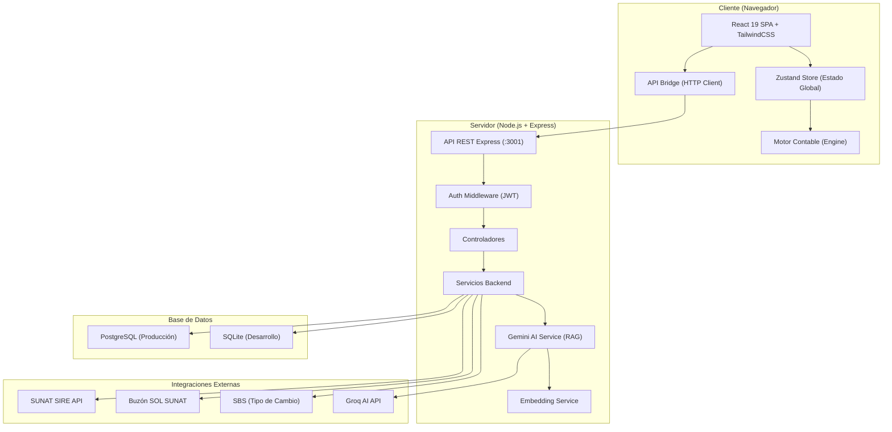
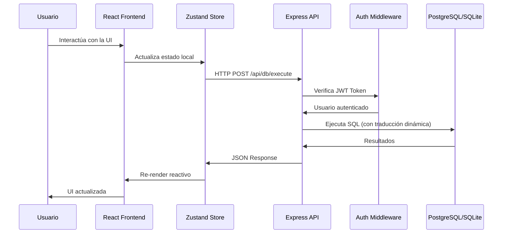
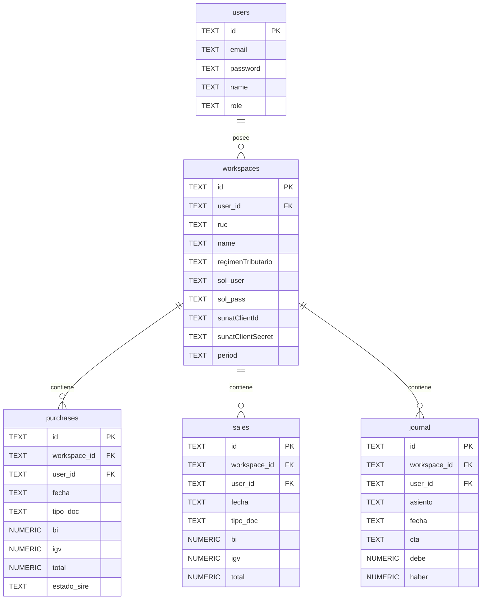
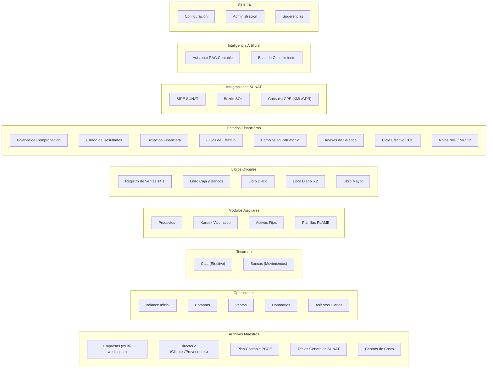
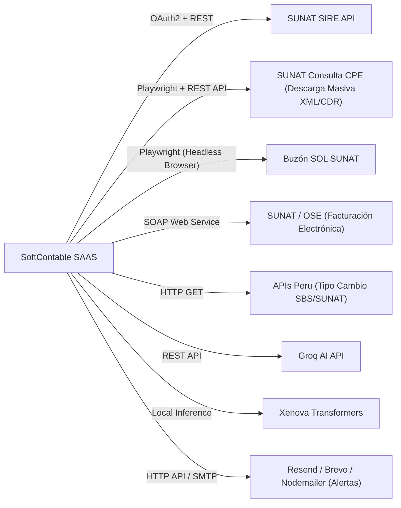

# 📋 AUDITORÍA TÉCNICA INTEGRAL — SOFTCONTABLE SAAS v2.0.0

> **Documento para presentación a Gerencia**
> Fecha de auditoría: 16 de Agosto de 2026
> Auditor técnico: Análisis automatizado sobre repositorio `softcontableperu1`
> Autor del sistema: Angelo Serna Simeon

---

## 1. RESUMEN EJECUTIVO

**SoftContable** es un Software as a Service (SaaS) especializado en **contabilidad, tributación y facturación electrónica** para empresas peruanas. El sistema opera bajo normativa vigente de SUNAT y cumple con estándares NIIF/NIC.

| Concepto | Detalle |
|---|---|
| **Nombre del producto** | SoftContable SAAS |
| **Versión actual** | 2.0.0 (Julio 2026) |
| **Tipo de aplicación** | Web Application (SPA) con capacidad PWA |
| **Repositorio** | `https://github.com/aangelo2555/softcontableperu1.git` |
| **Rama principal** | `main` (única rama activa) |
| **Total de commits** | 303 |
| **Plataforma de despliegue** | Railway (PaaS en la nube) |
| **Infraestructura** | Docker multi-stage con health checks |
| **Archivos de código fuente** | ~90 archivos (.js, .ts, .tsx, .json) |

---

## 2. STACK TECNOLÓGICO COMPLETO

### 2.1 Frontend (Interfaz de Usuario)

| Tecnología | Versión | Propósito |
|---|---|---|
| **React** | 19.2.4 | Framework de interfaz de usuario |
| **TypeScript** | ~5.9.3 | Tipado estático para mayor seguridad del código |
| **Vite** | 8.0.1 | Bundler y servidor de desarrollo |
| **Zustand** | 5.0.12 | Gestión de estado global (store reactivo) |
| **TailwindCSS** | 4.2.2 | Framework de estilos CSS utilitario |
| **Lucide React** | 1.7.0 | Biblioteca de iconos SVG |
| **React Hot Toast** | 2.6.0 | Sistema de notificaciones tipo toast |
| **ExcelJS** | 4.4.0 | Generación de archivos Excel en el cliente |
| **FileSaver** | 2.0.5 | Descarga de archivos generados |
| **pdf-lib** | 1.17.1 | Generación y manipulación de PDFs |

### 2.2 Backend (Servidor)

| Tecnología | Versión | Propósito |
|---|---|---|
| **Node.js** | 20+ | Runtime de JavaScript del servidor |
| **Express** | 4.21.2 | Framework HTTP para la API REST |
| **PostgreSQL** (pg) | 8.22.0 | Base de datos relacional en producción |
| **better-sqlite3** | 12.9.0 | Base de datos SQLite para desarrollo local |
| **JSON Web Tokens** | 9.0.2 | Autenticación stateless con tokens |
| **bcryptjs** | 2.4.3 | Hashing seguro de contraseñas |
| **Helmet** | 8.3.0 | Cabeceras de seguridad HTTP |
| **express-rate-limit** | 8.5.2 | Protección contra fuerza bruta |
| **Playwright** | 1.58.2 | Automatización de navegador (SIRE / Buzón SUNAT) |
| **Axios** | 1.15.2 | Cliente HTTP para APIs externas |
| **Winston** | 3.19.0 | Sistema de logging estructurado |
| **Compression** | 1.7.4 | Compresión GZIP de respuestas |
| **Nodemailer** | 8.0.4 | Envío de correos electrónicos |
| **ADM-Zip** | 0.5.17 | Manipulación de archivos ZIP |
| **dotenv** | 17.3.1 | Carga de variables de entorno |
| **uuid** | 11.1.0 | Generación de identificadores únicos |

### 2.3 Inteligencia Artificial

| Tecnología | Propósito |
|---|---|
| **Groq API** (LLaMA/Gemma) | Modelo de lenguaje para asistente contable |
| **@xenova/transformers** | Embeddings semánticos locales (paraphrase-multilingual-MiniLM-L12-v2) |
| **RAG (Retrieval-Augmented Generation)** | Base de conocimiento tributaria con búsqueda vectorial |

### 2.4 Infraestructura y DevOps

| Herramienta | Propósito |
|---|---|
| **Docker** | Contenerización multi-stage (build + producción) |
| **Railway** | PaaS para hosting en la nube |
| **GitHub** | Control de versiones y repositorio remoto |
| **PWA (Service Worker)** | Capacidad de instalación como app nativa |

---

## 3. ARQUITECTURA DEL SISTEMA

### 3.1 Diagrama de Arquitectura General



### 3.2 Patrón Arquitectónico

El sistema implementa una **arquitectura cliente-servidor de dos capas** con:

1. **Frontend SPA (Single Page Application)**: React con estado global en Zustand. Toda la navegación ocurre sin recarga de página.
2. **Backend API REST**: Express con middleware de autenticación JWT. Cada petición incluye token y se valida el workspace del usuario.
3. **Base de datos dual**: Selector dinámico entre PostgreSQL y SQLite mediante la variable `USE_POSTGRES`.

### 3.3 Flujo de Datos



---

## 4. ESTRUCTURA DEL PROYECTO — MAPA COMPLETO DE ARCHIVOS

### 4.1 Directorio Raíz

```
SOFTCONTABLE_WEB_READY/
├── .env                    # Variables de entorno (no versionado)
├── .env.example            # Plantilla de variables de entorno
├── .gitignore              # Exclusiones de Git
├── .railwayignore          # Exclusiones de Railway
├── Dockerfile              # Configuración Docker multi-stage
├── index.html              # Punto de entrada HTML de la SPA
├── package.json            # Dependencias y scripts NPM
├── package-lock.json       # Lock file de dependencias
├── railway-backend.json    # Configuración de despliegue Railway
├── railway-frontend.json   # Configuración frontend Railway
├── tsconfig.json           # Configuración TypeScript raíz
├── tsconfig.app.json       # Config TypeScript para la app
├── tsconfig.node.json      # Config TypeScript para Node
├── vite.config.ts          # Configuración de Vite bundler
└── README.md               # Documentación del proyecto
```

### 4.2 Frontend — `src/` (Código Fuente React + TypeScript)

```
src/
├── main.tsx                   # Bootstrap de React (punto de entrada)
├── App.tsx                    # Componente raíz, routing y sidebar (1,135 líneas)
├── App.css                    # Estilos globales adicionales
├── index.css                  # Estilos base y sistema de diseño
├── store.ts                   # Estado global Zustand (3,499 líneas — ☆ archivo clave)
├── vite-env.d.ts              # Tipos de Vite
│
├── components/                # ★ 42 componentes de vista + 16 componentes UI
│   ├── Login.tsx              # Sistema de login/registro (50,775 bytes)
│   ├── AdminView.tsx          # Panel de administración (52,946 bytes)
│   ├── EmpresaView.tsx        # Dashboard principal por empresa (57,580 bytes)
│   ├── ComprasView.tsx        # Registro de Compras
│   ├── VentasView.tsx         # Registro de Ventas
│   ├── HonorariosView.tsx     # Registro de Honorarios
│   ├── AsientosView.tsx       # Asientos de Diario (50,891 bytes)
│   ├── PlanillaView.tsx       # Planilla de Sueldos (56,326 bytes)
│   ├── PlanView.tsx           # Plan Contable PCGE
│   ├── CliProView.tsx         # Directorio de Clientes y Proveedores
│   ├── ClientesView.tsx       # Gestión de Empresas (multi-workspace)
│   ├── DatosView.tsx          # Tablas Generales (catálogos SUNAT)
│   ├── CostosView.tsx         # Centros de Costo
│   ├── ProductosView.tsx      # Maestro de Productos
│   ├── KardexView.tsx         # Kárdex Valorizado (21,539 bytes)
│   ├── ActivosFijosView.tsx   # Gestión de Activos Fijos (29,148 bytes)
│   ├── DiarioView.tsx         # Libro Diario
│   ├── LibroDiario52View.tsx  # Libro Diario Formato 5.2 SUNAT (80,458 bytes)
│   ├── MayorView.tsx          # Libro Mayor
│   ├── RegistroVentas141View.tsx # Registro de Ventas 14.1
│   ├── LibroCajaBancosView.tsx   # Libro Caja y Bancos
│   ├── HHTTView.tsx           # Balance de Comprobación (10 columnas)
│   ├── EgypView.tsx           # Estado de Ganancias y Pérdidas
│   ├── BalanceView.tsx        # Estado de Situación Financiera
│   ├── BalanceAnexosView.tsx  # Anexos de Balance (37,748 bytes)
│   ├── BalanceInicialView.tsx # Balance de Apertura
│   ├── FinanceSecondaryView.tsx # Estado de Flujos de Efectivo / Patrimonio
│   ├── FinanceNotesView.tsx   # Notas NIIF y NIC 12 (51,374 bytes)
│   ├── CCCDashboard.tsx       # Ciclo de Conversión de Efectivo (CCC)
│   ├── CajaDashboard.tsx      # Dashboard de Caja (Efectivo)
│   ├── MovimientosDashboard.tsx # Dashboard de Bancos (80,822 bytes)
│   ├── SireView.tsx           # Módulo SIRE SUNAT (56,702 bytes)
│   ├── BuzonModule.tsx        # Buzón Electrónico SOL (40,507 bytes)
│   ├── AIChatPanel.tsx        # Asistente IA RAG (29,559 bytes)
│   ├── AIKnowledgeView.tsx    # Base de Conocimiento IA (29,976 bytes)
│   ├── MantenimientoView.tsx  # Configuración del sistema
│   ├── SuggestionBox.tsx      # Buzón de Sugerencias
│   ├── StudentDashboard.tsx   # Dashboard para modo Estudiante
│   ├── OperationForm.tsx      # Formulario de operaciones (56,736 bytes)
│   ├── BaseOperationForm.tsx  # Formulario base reutilizable
│   ├── DataTable.tsx          # Tabla de datos genérica
│   ├── XtraView.tsx           # Vista extra/miscelánea
│   ├── SoftPremiumDashboard.tsx # Dashboard de Suscripción Premium e IA RAG
│   ├── CookieBanner.tsx       # Banner de consentimiento de cookies
│   ├── LegalPages.tsx         # Páginas legales (Términos, Privacidad, etc.)
│   ├── ChangePasswordModal.tsx# Modal para cambio de contraseña
│   │
│   ├── shared/                # Componentes compartidos reutilizables
│   │   ├── Badge.tsx          # Insignias / etiquetas
│   │   ├── ConfirmModal.tsx   # Modal de confirmación
│   │   ├── DateInput.tsx      # Input de fecha
│   │   ├── DecimalInput.tsx   # Input de decimales
│   │   ├── EmptyState.tsx     # Estado vacío (sin datos)
│   │   ├── Modal.tsx          # Modal genérico
│   │   ├── SectionHeader.tsx  # Header de sección
│   │   ├── StaleWarningBanner.tsx # Banner de dato desactualizado
│   │   ├── StatCard.tsx       # Tarjeta de estadísticas
│   │   └── Toast.tsx          # Notificación tipo toast
│   │
│   └── ui/                    # Componentes UI primitivos
│       ├── ActionBar.tsx      # Barra de acciones
│       ├── Button.tsx         # Botón reutilizable
│       ├── FormField.tsx      # Campo de formulario
│       ├── PageHeader.tsx     # Header de página
│       ├── Pagination.tsx     # Paginación
│       └── TitleBar.tsx       # Barra de título
│
├── engine/                    # ★ Motor Contable / Reglas de Negocio (18 archivos)
│   ├── bankReconciliation.ts  # Conciliación Bancaria
│   ├── cascadeInvalidator.ts  # Invalidación en cascada de módulos
│   ├── crossBookValidator.ts  # Validación cruzada entre libros
│   ├── deferredTax.ts         # Cálculo de Impuesto Diferido (NIC 12)
│   ├── doubleEntryValidator.ts # Validación de partida doble
│   ├── fiscal_config_2026.json # Configuración fiscal 2026 (UIT, tasas)
│   ├── fxAdjustment.ts        # Ajuste por diferencia de cambio
│   ├── igvSegmentation.ts     # Segmentación de IGV (gravado/no gravado)
│   ├── notesGenerator.ts      # Generador de Notas NIIF
│   ├── pcgeAuditor.ts         # Auditor del Plan Contable PCGE
│   ├── pcgeInference.ts       # Inferencia automática de cuentas
│   ├── periodClose.ts         # Cierre de período contable
│   ├── prorataIGV.ts          # Cálculo de prorrata de IGV
│   ├── regimeEngine.ts        # Motor de regímenes tributarios
│   ├── sireParser.ts          # Parser de archivos SIRE
│   ├── sireReconciliation.ts  # Conciliación SIRE vs Sistema
│   ├── sire_ingestion_config.json # Config de ingesta SIRE
│   └── sunatCatalogs.ts       # Catálogos oficiales SUNAT
│
├── services/                  # Servicios del frontend
│   ├── apiBridge.ts           # Puente HTTP hacia el backend (21,665 bytes)
│   └── apiService.ts          # Configuración del servicio API
│
├── hooks/                     # React Hooks personalizados
│   └── usePagination.ts       # Hook de paginación
│
├── utils/                     # Utilidades
│   ├── bankImporter.ts        # Importador de extractos bancarios
│   ├── excelExport.ts         # Exportación a Excel
│   ├── export.ts              # Exportación general
│   ├── massiveExport.ts       # Exportación masiva (26,866 bytes)
│   ├── migrationRunner.ts     # Ejecutor de migraciones
│   ├── seedCasuistica.ts      # Seeder de casuística contable
│   └── tributarioRules.ts     # Reglas tributarias peruanas
│
├── logic/                     # Lógica de negocio y datos iniciales
│   ├── plan.ts                # Plan Contable PCGE completo (180,599 bytes)
│   ├── compras.ts             # Lógica de compras
│   ├── ventas.ts              # Lógica de ventas
│   ├── asientos.ts            # Lógica de asientos
│   ├── data.ts                # Datos auxiliares
│   └── results.ts             # Lógica de resultados
│
├── constants/                 # Constantes
│   └── tributario.ts          # Constantes tributarias (11,210 bytes)
│
└── assets/                    # Recursos estáticos
```

### 4.3 Backend — `server/` (API Node.js + Express)

```
server/
├── app.js                     # ★ Punto de entrada Express (2,773 líneas / 127 KB)
├── authRoutes.js              # Rutas de autenticación (login/registro/OTP)
├── authPremium.js             # Lógica de verificación de suscripciones premium
├── databasePostgres.js        # ★ Conector PostgreSQL (2,013 líneas / 99 KB)
├── databaseServer.js          # Conector SQLite (76 KB)
├── poolPremium.js             # Conexión dedicada a BD Premium
├── geminiService.js           # Servicio de IA / RAG contable (539 líneas)
├── embeddingService.js        # Embeddings semánticos locales
├── cryptoUtils.js             # Cifrado AES-256-GCM
├── autoSyncService.js         # Sincronización automática SUNAT
├── cacheService.js            # Servicio de caché en memoria
├── storageConfig.js           # Configuración de almacenamiento
├── libroDiario52Service.js    # Generador Libro Diario 5.2 (28 KB)
├── retenciones41Service.js    # Servicio de Retenciones 4.1
├── ple71Service.js            # Servicio PLE 7.1
├── costs101Service.js         # Servicio de Costos 10.1
├── kardex121Service.js        # Servicio Kárdex 12.1
├── sbsService.js              # Consulta tipo de cambio SBS
├── ublService.js              # Servicio UBL para facturación electrónica
├── planContable.json          # Plan Contable en JSON (235 KB)
│
├── controllers/               # Controladores MVC
│   └── dbController.js        # Controlador de base de datos
│
├── routes/                    # Rutas API
│   ├── dbRoutes.js            # Rutas de base de datos
│   ├── premiumAdminRoutes.js      # Rutas de administración premium
│   ├── premiumFinanzasRoutes.js   # Rutas del módulo Finanzas premium
│   ├── premiumPlanillasRoutes.js  # Rutas del módulo Planillas premium
│   ├── premiumSubscriptionRoutes.js# Rutas de suscripción y pagos premium
│   └── premiumTributarioRoutes.js # Rutas del módulo Tributario premium
│
├── services/                  # Servicios de integración Backend
│   ├── premiumCashflowService.js  # Servicio de proyecciones de caja IA
│   ├── premiumPayrollService.js   # Servicio de auditoría de planillas IA
│   ├── premiumRiskService.js      # Servicio de scoring de riesgo SUNAT
│   └── ragKnowledgeService.js     # Servicio RAG para base de conocimiento IA
│
└── knowledge/                 # ★ Base de conocimiento IA (RAG)
    ├── casos_practicos.json   # Casos prácticos contables (128 KB)
    ├── leyes_tributarias.json # Leyes tributarias peruanas
    ├── normas_niif_nic.json   # Normas NIIF y NIC
    ├── reglas_operativas.json # Reglas operativas
    ├── resoluciones_sunat.json # Resoluciones SUNAT
    └── terminologia_contable.json # Terminología contable
```

### 4.4 Módulo SIRE / Buzón SUNAT

```
modulo/                            # Módulo SIRE SUNAT
├── sireOrchestrator.js            # Orquestador general del flujo SIRE
├── sireHandler.js                 # Handler principal SIRE
├── sireAjustesHandler.js          # Handler de ajustes SIRE (87 KB)
├── sireFileGenerator.js           # Generador de archivos SIRE
├── sireFileManager.js             # Gestión de archivos SIRE
├── sunatApi.js                    # Conector con API SUNAT
├── excelGenerator.js              # Generación de Excel SIRE
├── excelReader.js                 # Lectura de Excel SIRE
├── ajustesExcelCreator.js         # Creador de Excel de ajustes
├── fileProcessor.js               # Procesador de archivos
├── pathResolver.js                # Resolución de rutas
└── logger.js                      # Logger del módulo

main/                              # Módulo Buzón Electrónico SOL
├── buzonHandler.js                # Handler del Buzón SOL (33 KB)
├── emailService.js                # Servicio de email
├── pdfMergerService.js            # Servicio de merge de PDFs
├── config.js                      # Configuración del módulo
├── logger.js                      # Logger
└── logger_web.js                  # Logger para entorno web
```

### 4.5 Scripts de Mantenimiento

```
scripts/
├── migrate-to-postgres.js         # Migración SQLite → PostgreSQL
├── import-to-postgres.js          # Importación masiva a PostgreSQL
├── create-schema.js               # Creación de esquema
├── create-indexes.js              # Creación de índices
├── clean-postgres.js              # Limpieza de PostgreSQL
├── fix-workspaces-constraint.js   # Fix de constraints de workspaces
├── seed-ai-knowledge.js           # Seeder de base IA
├── stress_test.js                 # Pruebas de estrés
└── test-rag.js                    # Test del sistema RAG
```

---

## 5. MODELO DE BASE DE DATOS

### 5.1 Tablas del Sistema (27 tablas)



### 5.2 Catálogo Completo de Tablas

| # | Tabla | Descripción | Índices |
|---|---|---|---|
| 1 | `users` | Usuarios del sistema (autenticación) | `email` |
| 2 | `workspaces` | Empresas/espacios de trabajo | `user_id` |
| 3 | `purchases` | Registro de Compras | `workspace_id`, `user_id`, `fecha` |
| 4 | `sales` | Registro de Ventas | `workspace_id`, `user_id`, `fecha` |
| 5 | `journal` | Libro de Asientos Diarios | `workspace_id`, `user_id`, `fecha`, `cta` |
| 6 | `asientos` | Asientos contables (header + líneas JSON) | `workspace_id`, `user_id` |
| 7 | `plan_global` | Plan Contable General Empresarial | `user_id` (PK compuesta: cta + user_id) |
| 8 | `entities` | Directorio de Clientes y Proveedores | `workspace_id`, `user_id` |
| 9 | `honorarios` | Registro de Honorarios (4ta categoría) | `workspace_id`, `user_id` |
| 10 | `costs` | Centros de Costo | `workspace_id`, `user_id` |
| 11 | `accounting_periods` | Períodos contables (apertura/cierre) | `workspace_id`, `user_id` |
| 12 | `period_versions` | Versionamiento de períodos | `workspace_id`, `user_id`, `module` |
| 13 | `buzon_messages` | Mensajes del Buzón SOL SUNAT | `workspace_id` |
| 14 | `sire_files` | Archivos SIRE almacenados | `workspace_id`, `user_id` |
| 15 | `products` | Maestro de Productos | `workspace_id`, `user_id` |
| 16 | `maintenance` | Datos de mantenimiento | `workspace_id`, `user_id` |
| 17 | `movimientos_data` | Datos de movimientos bancarios | `workspace_id`, `user_id` |
| 18 | `fixed_assets` | Activos Fijos (deprecación) | `workspace_id`, `user_id` |
| 19 | `employees` | Planilla de empleados | `workspace_id`, `user_id` |
| 20 | `inventory_movements` | Movimientos de inventario (Kárdex) | `workspace_id`, `user_id`, `reference_id` |
| 21 | `cash_movements` | Movimientos de Caja | `workspace_id`, `user_id` |
| 22 | `bank_statements` | Extractos bancarios | `workspace_id`, `user_id`, `reconciled_journal_id` |
| 23 | `suggestions` | Buzón de sugerencias | `user_id`, `status` |
| 24 | `libro_diario_52` | Libro Diario Formato 5.2 SUNAT | 7 índices (workspace, periodo, cuo, estado, origen, cuenta) |
| 25 | `sbs_rates` | Tipo de cambio SBS | `fecha` (PK) |
| 26 | `audit_logs` | Logs de auditoría | `workspace_id`, `user_id`, `timestamp` |
| 27 | `glosas_habituales` | Glosas predefinidas | `workspace_id`, `user_id` |
| 28 | `balance_inicial` | Balance de Apertura | `workspace_id`, `user_id` |
| 29 | `finance_notes` | Notas NIIF a los estados financieros | `workspace_id` (unique: workspace + periodo + user) |
| 30 | `deferred_tax_computations` | Cómputo de impuesto diferido NIC 12 | `workspace_id` (unique: workspace + periodo + user) |
| 31 | `ai_knowledge_base` | Base de conocimiento IA (RAG) | `sector`, `regimen`, `tipo` |

### 5.3 Arquitectura de Base de Datos Dual

El sistema implementa un patrón **Database Abstraction Layer** que permite operar con dos motores de base de datos:

```
┌─────────────────────────┐
│    app.js (Entry Point) │
│                         │
│ USE_POSTGRES = env var  │
└──────────┬──────────────┘
           │
    ┌──────┴──────────────────────┐
    │                             │
    ▼                             ▼
┌──────────────────┐   ┌──────────────────────┐
│ databaseServer.js│   │ databasePostgres.js  │
│ (SQLite - Dev)   │   │ (PostgreSQL - Prod)  │
│                  │   │                      │
│ • WAL mode       │   │ • Pool (30 conex.)   │
│ • File-based     │   │ • SSL automático     │
│ • Zero config    │   │ • SQL translator     │
│ • ~76 KB         │   │ • ~99 KB             │
└──────────────────┘   └──────────────────────┘
```

El conector PostgreSQL incluye un **traductor de dialectos SQL en tiempo real** (`translateSqliteToPostgres()`) que convierte automáticamente:
- Placeholders `?` → `$N` (parámetros numerados)
- `AUTOINCREMENT` → `SERIAL`
- `datetime('now')` → `NOW()`
- Columna reservada `desc` → `descripcion`
- Y más de 15 transformaciones adicionales

---

## 6. MÓDULOS FUNCIONALES DEL SISTEMA

### 6.1 Mapa de Módulos



### 6.2 Detalle de Cada Módulo

#### 📊 Archivos Maestros (5 módulos)

| Módulo | Componente | Descripción |
|---|---|---|
| **Mis Empresas** | [ClientesView.tsx](file:///c:/Users/aange/Desktop/SOFTCONTABLE_WEB_READY/src/components/ClientesView.tsx) | Gestión multi-empresa (workspaces). Cada empresa tiene RUC, régimen tributario, credenciales SOL, certificado digital. |
| **Directorio** | [CliProView.tsx](file:///c:/Users/aange/Desktop/SOFTCONTABLE_WEB_READY/src/components/CliProView.tsx) | Directorio de clientes y proveedores con RUC, razón social y tipo. |
| **Plan Contable** | [PlanView.tsx](file:///c:/Users/aange/Desktop/SOFTCONTABLE_WEB_READY/src/components/PlanView.tsx) | Plan Contable General Empresarial (PCGE) completo. ~180 KB de cuentas predefinidas. Soporta amarre de cuentas, centros de costo y prorrateo. |
| **Tablas Generales** | [DatosView.tsx](file:///c:/Users/aange/Desktop/SOFTCONTABLE_WEB_READY/src/components/DatosView.tsx) | Catálogos SUNAT (tipos de documento, tipos de operación, monedas, etc.) |
| **Centros de Costo** | [CostosView.tsx](file:///c:/Users/aange/Desktop/SOFTCONTABLE_WEB_READY/src/components/CostosView.tsx) | Configuración de centros de costo con porcentajes y cuentas de distribución. |

#### 🧾 Operaciones (5 módulos)

| Módulo | Componente | Descripción |
|---|---|---|
| **Balance Inicial** | [BalanceInicialView.tsx](file:///c:/Users/aange/Desktop/SOFTCONTABLE_WEB_READY/src/components/BalanceInicialView.tsx) | Carga de saldos iniciales por cuenta contable. |
| **Compras** | [ComprasView.tsx](file:///c:/Users/aange/Desktop/SOFTCONTABLE_WEB_READY/src/components/ComprasView.tsx) + [OperationForm.tsx](file:///c:/Users/aange/Desktop/SOFTCONTABLE_WEB_READY/src/components/OperationForm.tsx) | Registro de compras con IGV, ICBPER, ISC, detracciones, retenciones, percepciones. Soporte SPOT. Integración SIRE. |
| **Ventas** | [VentasView.tsx](file:///c:/Users/aange/Desktop/SOFTCONTABLE_WEB_READY/src/components/VentasView.tsx) + [OperationForm.tsx](file:///c:/Users/aange/Desktop/SOFTCONTABLE_WEB_READY/src/components/OperationForm.tsx) | Registro de ventas con todos los tributos. Asociación de inventario. Costo de ventas automático. |
| **Honorarios** | [HonorariosView.tsx](file:///c:/Users/aange/Desktop/SOFTCONTABLE_WEB_READY/src/components/HonorariosView.tsx) | Registro de recibos por honorarios de 4ta categoría con retención del 8%. |
| **Asientos Diarios** | [AsientosView.tsx](file:///c:/Users/aange/Desktop/SOFTCONTABLE_WEB_READY/src/components/AsientosView.tsx) | Creación de asientos contables manuales con validación de partida doble. |

#### 🏦 Tesorería (2 módulos)

| Módulo | Componente | Descripción |
|---|---|---|
| **Caja** | [CajaDashboard.tsx](file:///c:/Users/aange/Desktop/SOFTCONTABLE_WEB_READY/src/components/CajaDashboard.tsx) | Control de efectivo con ingresos y egresos diarios. |
| **Bancos** | [MovimientosDashboard.tsx](file:///c:/Users/aange/Desktop/SOFTCONTABLE_WEB_READY/src/components/MovimientosDashboard.tsx) | Dashboard bancario con conciliación. Importación de extractos. (80 KB) |

#### 📦 Módulos Auxiliares (4 módulos)

| Módulo | Componente | Descripción |
|---|---|---|
| **Productos** | [ProductosView.tsx](file:///c:/Users/aange/Desktop/SOFTCONTABLE_WEB_READY/src/components/ProductosView.tsx) | Maestro de productos con código, unidad, precio y stock. |
| **Kárdex** | [KardexView.tsx](file:///c:/Users/aange/Desktop/SOFTCONTABLE_WEB_READY/src/components/KardexView.tsx) | Kárdex valorizado con método de costeo PEPS/Promedio. Formato 12.1. |
| **Activos Fijos** | [ActivosFijosView.tsx](file:///c:/Users/aange/Desktop/SOFTCONTABLE_WEB_READY/src/components/ActivosFijosView.tsx) | Gestión de activos fijos con depreciación acumulada y valor neto. |
| **Planillas** | [PlanillaView.tsx](file:///c:/Users/aange/Desktop/SOFTCONTABLE_WEB_READY/src/components/PlanillaView.tsx) | Planilla de sueldos bajo normativa PLAME 2026. (56 KB) |

#### 📚 Libros Oficiales (5 módulos)

| Módulo | Componente | Descripción |
|---|---|---|
| **Registro de Ventas** | [RegistroVentas141View.tsx](file:///c:/Users/aange/Desktop/SOFTCONTABLE_WEB_READY/src/components/RegistroVentas141View.tsx) | Formato 14.1 SUNAT para registro de ventas. |
| **Libro Caja y Bancos** | [LibroCajaBancosView.tsx](file:///c:/Users/aange/Desktop/SOFTCONTABLE_WEB_READY/src/components/LibroCajaBancosView.tsx) | Formato oficial de Libro de Caja y Bancos. |
| **Libro Diario** | [DiarioView.tsx](file:///c:/Users/aange/Desktop/SOFTCONTABLE_WEB_READY/src/components/DiarioView.tsx) | Libro Diario con asientos centralizados. |
| **Libro Diario 5.2** | [LibroDiario52View.tsx](file:///c:/Users/aange/Desktop/SOFTCONTABLE_WEB_READY/src/components/LibroDiario52View.tsx) | Formato 5.2 SUNAT para el Libro Diario electrónico. **(80 KB — módulo más complejo)** |
| **Libro Mayor** | [MayorView.tsx](file:///c:/Users/aange/Desktop/SOFTCONTABLE_WEB_READY/src/components/MayorView.tsx) | Libro Mayor por cuenta contable. |

#### 📈 Estados Financieros (7 módulos)

| Módulo | Componente | Descripción |
|---|---|---|
| **Balance de Comprobación** | [HHTTView.tsx](file:///c:/Users/aange/Desktop/SOFTCONTABLE_WEB_READY/src/components/HHTTView.tsx) | Balance de Comprobación de 10 columnas (saldos iniciales, movimientos, saldos finales, inventario, resultados). |
| **Estado de Resultados** | [EgypView.tsx](file:///c:/Users/aange/Desktop/SOFTCONTABLE_WEB_READY/src/components/EgypView.tsx) | Estado de Ganancias y Pérdidas por Naturaleza y Función. |
| **Situación Financiera** | [BalanceView.tsx](file:///c:/Users/aange/Desktop/SOFTCONTABLE_WEB_READY/src/components/BalanceView.tsx) | Estado de Situación Financiera (activos, pasivos, patrimonio). |
| **Flujos de Efectivo / Patrimonio** | [FinanceSecondaryView.tsx](file:///c:/Users/aange/Desktop/SOFTCONTABLE_WEB_READY/src/components/FinanceSecondaryView.tsx) | Estado de Flujos de Efectivo (método directo/indirecto) y Estado de Cambios en el Patrimonio Neto. |
| **Anexos de Balance** | [BalanceAnexosView.tsx](file:///c:/Users/aange/Desktop/SOFTCONTABLE_WEB_READY/src/components/BalanceAnexosView.tsx) | Anexos detallados del Balance General. |
| **Ciclo Efectivo** | [CCCDashboard.tsx](file:///c:/Users/aange/Desktop/SOFTCONTABLE_WEB_READY/src/components/CCCDashboard.tsx) | Indicador del Ciclo de Conversión de Efectivo (CCC). |
| **Notas NIIF** | [FinanceNotesView.tsx](file:///c:/Users/aange/Desktop/SOFTCONTABLE_WEB_READY/src/components/FinanceNotesView.tsx) | Notas a los estados financieros bajo NIIF. Incluye cálculo de impuesto diferido NIC 12. (51 KB) |

#### 🔗 Integraciones SUNAT (3 módulos)

| Módulo | Componente | Descripción |
|---|---|---|
| **SIRE** | [SireView.tsx](file:///c:/Users/aange/Desktop/SOFTCONTABLE_WEB_READY/src/components/SireView.tsx) + [modulo/](file:///c:/Users/aange/Desktop/SOFTCONTABLE_WEB_READY/modulo) | Descarga, conciliación SUNAT vs Sistema, ajustes y centralización. Usa Playwright para automatización web y APIs OAuth2 SUNAT. |
| **Buzón SOL** | [BuzonModule.tsx](file:///c:/Users/aange/Desktop/SOFTCONTABLE_WEB_READY/src/components/BuzonModule.tsx) + [main/buzonHandler.js](file:///c:/Users/aange/Desktop/SOFTCONTABLE_WEB_READY/main/buzonHandler.js) | Auditoría en tiempo real del buzón SOL. Descarga automática de resoluciones y notificaciones SUNAT. |
| **Consulta CPE** | [main/cpeHandler.js](file:///c:/Users/aange/Desktop/SOFTCONTABLE_WEB_READY/main/cpeHandler.js) | Descarga masiva automatizada de archivos XML y CDR. Usa Playwright para interceptar el token JWT de sesión e invocar la API REST oculta (`api-cpe.sunat.gob.pe`). Incluye DOM Fallback. |

#### 🤖 Inteligencia Artificial y Premium (3 módulos)

| Módulo | Componente | Descripción |
|---|---|---|
| **Asistente IA** | [AIChatPanel.tsx](file:///c:/Users/aange/Desktop/SOFTCONTABLE_WEB_READY/src/components/AIChatPanel.tsx) + [geminiService.js](file:///c:/Users/aange/Desktop/SOFTCONTABLE_WEB_READY/server/geminiService.js) | Chat con IA especializado en tributación peruana. Usa RAG con búsqueda vectorial semántica sobre base de conocimiento local. |
| **Base de Conocimiento** | [AIKnowledgeView.tsx](file:///c:/Users/aange/Desktop/SOFTCONTABLE_WEB_READY/src/components/AIKnowledgeView.tsx) + [server/knowledge/](file:///c:/Users/aange/Desktop/SOFTCONTABLE_WEB_READY/server/knowledge) | Administración de la base de conocimiento: casos prácticos, leyes tributarias, normas NIIF/NIC, resoluciones SUNAT, terminología contable. |
| **SoftPremium IA** | [SoftPremiumDashboard.tsx](file:///c:/Users/aange/Desktop/SOFTCONTABLE_WEB_READY/src/components/SoftPremiumDashboard.tsx) + [server/routes/premium...](file:///c:/Users/aange/Desktop/SOFTCONTABLE_WEB_READY/server/routes/) | Auditoría Tributaria y Laboral, Analítica Financiera (Proyecciones Cashflow/Dupont con IA), y gestión de suscripciones premium. |

---

## 7. SEGURIDAD

### 7.1 Capa de Autenticación

| Mecanismo | Implementación |
|---|---|
| **Hashing de contraseñas** | bcryptjs con salt de 10 rondas |
| **Tokens de sesión** | JWT con expiración de 24 horas |
| **Recuperación de cuenta** | OTP por email (Nodemailer) con expiración de 15 min |
| **Rate limiting** | 5 intentos/minuto por IP en login y registro |
| **Roles de usuario** | `admin`, `user`, `estudiante` |
| **JWT obligatorio en producción** | `JWT_SECRET` env var requerida o el servidor no arranca |

### 7.2 Capa de API

| Mecanismo | Implementación |
|---|---|
| **Helmet** | Cabeceras HTTP de seguridad (X-Frame-Options, X-XSS-Protection, etc.) |
| **CORS restringido** | Solo orígenes permitidos (`localhost`, Railway subdomains) |
| **SQL Injection Prevention** | Validación `isSafeSql()` bloquea DDL, GRANT, PRAGMA, acceso a `users` |
| **Middleware de inspección** | Solo admins pueden inspeccionar datos de otros usuarios |
| **Endpoints admin-only** | Middleware `adminOnlyInProdMiddleware` para endpoints de debug |

### 7.3 Cifrado de Datos Sensibles

| Dato | Algoritmo | Archivo |
|---|---|---|
| Credenciales SOL (usuario/clave) | AES-256-GCM | [cryptoUtils.js](file:///c:/Users/aange/Desktop/SOFTCONTABLE_WEB_READY/server/cryptoUtils.js) |
| Client ID / Client Secret SUNAT | AES-256-GCM | [cryptoUtils.js](file:///c:/Users/aange/Desktop/SOFTCONTABLE_WEB_READY/server/cryptoUtils.js) |
| Certificado digital (.pfx) | AES-256-GCM | [cryptoUtils.js](file:///c:/Users/aange/Desktop/SOFTCONTABLE_WEB_READY/server/cryptoUtils.js) |
| `ENCRYPTION_KEY` obligatoria en producción | Env variable | `.env` |

### 7.4 Modo Estudiante (Restricciones)

| Restricción | Detalle |
|---|---|
| Límite de compras | 50 registros máximo |
| Límite de ventas | 50 registros máximo |
| Límite de asientos | 250 registros máximo |
| DELETE bloqueado | No puede eliminar registros vía SQL directo |
| Módulos restringidos | Solo 11 de los ~35 módulos disponibles |

---

## 8. MOTOR CONTABLE (ENGINE)

El directorio [engine/](file:///c:/Users/aange/Desktop/SOFTCONTABLE_WEB_READY/src/engine) contiene el **corazón de la lógica contable** del sistema:

| Motor | Archivo | Función |
|---|---|---|
| **Partida Doble** | [doubleEntryValidator.ts](file:///c:/Users/aange/Desktop/SOFTCONTABLE_WEB_READY/src/engine/doubleEntryValidator.ts) | Valida que Debe = Haber en cada asiento |
| **Validación Cruzada** | [crossBookValidator.ts](file:///c:/Users/aange/Desktop/SOFTCONTABLE_WEB_READY/src/engine/crossBookValidator.ts) | Verifica consistencia entre libros |
| **Invalidación en Cascada** | [cascadeInvalidator.ts](file:///c:/Users/aange/Desktop/SOFTCONTABLE_WEB_READY/src/engine/cascadeInvalidator.ts) | Cuando cambia un módulo, invalida los dependientes |
| **Cierre de Período** | [periodClose.ts](file:///c:/Users/aange/Desktop/SOFTCONTABLE_WEB_READY/src/engine/periodClose.ts) | Cierre mensual/anual con bloqueo de operaciones |
| **Impuesto Diferido** | [deferredTax.ts](file:///c:/Users/aange/Desktop/SOFTCONTABLE_WEB_READY/src/engine/deferredTax.ts) | Cálculo de impuesto diferido bajo NIC 12 (13 KB) |
| **Ajuste por TC** | [fxAdjustment.ts](file:///c:/Users/aange/Desktop/SOFTCONTABLE_WEB_READY/src/engine/fxAdjustment.ts) | Ajuste por diferencia de cambio |
| **IGV Segmentado** | [igvSegmentation.ts](file:///c:/Users/aange/Desktop/SOFTCONTABLE_WEB_READY/src/engine/igvSegmentation.ts) | Separación IGV gravado vs no gravado |
| **Prorrata IGV** | [prorataIGV.ts](file:///c:/Users/aange/Desktop/SOFTCONTABLE_WEB_READY/src/engine/prorataIGV.ts) | Cálculo de prorrata de crédito fiscal |
| **Inferencia PCGE** | [pcgeInference.ts](file:///c:/Users/aange/Desktop/SOFTCONTABLE_WEB_READY/src/engine/pcgeInference.ts) | Sugerencia automática de cuentas contables |
| **Auditor PCGE** | [pcgeAuditor.ts](file:///c:/Users/aange/Desktop/SOFTCONTABLE_WEB_READY/src/engine/pcgeAuditor.ts) | Verificación del plan contable |
| **Regímenes** | [regimeEngine.ts](file:///c:/Users/aange/Desktop/SOFTCONTABLE_WEB_READY/src/engine/regimeEngine.ts) | Motor de regímenes tributarios (RG, MYPE, RE) (12 KB) |
| **Notas NIIF** | [notesGenerator.ts](file:///c:/Users/aange/Desktop/SOFTCONTABLE_WEB_READY/src/engine/notesGenerator.ts) | Generador automático de notas a los EEFF |
| **Parser SIRE** | [sireParser.ts](file:///c:/Users/aange/Desktop/SOFTCONTABLE_WEB_READY/src/engine/sireParser.ts) | Parser de archivos planos SIRE |
| **Conciliación SIRE** | [sireReconciliation.ts](file:///c:/Users/aange/Desktop/SOFTCONTABLE_WEB_READY/src/engine/sireReconciliation.ts) | Conciliación SUNAT vs Sistema |
| **Conciliación Bancaria** | [bankReconciliation.ts](file:///c:/Users/aange/Desktop/SOFTCONTABLE_WEB_READY/src/engine/bankReconciliation.ts) | Conciliación con extractos bancarios |
| **Catálogos SUNAT** | [sunatCatalogs.ts](file:///c:/Users/aange/Desktop/SOFTCONTABLE_WEB_READY/src/engine/sunatCatalogs.ts) | Tablas oficiales de SUNAT |
| **Config Fiscal** | [fiscal_config_2026.json](file:///c:/Users/aange/Desktop/SOFTCONTABLE_WEB_READY/src/engine/fiscal_config_2026.json) | UIT, tasas de IR, tramos, etc. |

---

## 9. VARIABLES DE ENTORNO

| Variable | Obligatoria | Descripción |
|---|---|---|
| `DATABASE_URL` | Sí (prod) | URL de conexión PostgreSQL |
| `USE_POSTGRES` | Sí | `true` para PostgreSQL, `false` para SQLite |
| `DATABASE_PATH` | Solo dev | Ruta del archivo SQLite |
| `NODE_ENV` | Sí | `production` o `development` |
| `PORT` | Sí | Puerto del servidor (default: 3001) |
| `JWT_SECRET` | Sí (prod) | Secreto para firmar tokens JWT |
| `ENCRYPTION_KEY` | Sí (prod) | Clave AES-256 de 32 caracteres |
| `ENABLE_RATE_LIMIT` | Opcional | Activar rate limiting |
| `CACHE_TTL` | Opcional | Tiempo de vida del caché (ms) |
| `STORAGE_PATH` | Opcional | Directorio de almacenamiento |
| `ALLOWED_ORIGINS` | Opcional | Orígenes CORS permitidos (CSV) |
| `GROQ_API_KEY` | Opcional | API key para el servicio de IA |

---

## 10. DESPLIEGUE E INFRAESTRUCTURA

### 10.1 Docker Multi-Stage

```
┌───────────────────────────────────────────┐
│ STAGE 1: Build Frontend                   │
│ Base: node:20-slim                        │
│ • npm install                             │
│ • npm run build-renderer (Vite build)     │
│ Output: /app/dist/ (archivos estáticos)   │
└───────────────┬───────────────────────────┘
                │
                ▼
┌───────────────────────────────────────────┐
│ STAGE 2: Production Server                │
│ Base: mcr.microsoft.com/playwright:jammy  │
│ • npm install --omit=dev                  │
│ • COPY server, modulo, main, dist         │
│ • PORT: 3001                              │
│ • HEALTHCHECK: /api/health                │
│ • CMD: node server/app.js                 │
└───────────────────────────────────────────┘
```

### 10.2 Railway Configuration

| Config | Valor |
|---|---|
| Builder | NIXPACKS |
| Build command | `npm install --production` |
| Start command | `node server/app.js` |
| Healthcheck path | `/api/health` |
| Healthcheck timeout | 100s |
| Restart policy | ON_FAILURE (max 3 retries) |

### 10.3 Health Check Endpoint

El endpoint `GET /api/health` retorna:
- Estado del servidor
- Uptime
- Tipo de base de datos activa
- Estadísticas de caché
- Uso de memoria (RSS + Heap)

---

## 11. INTEGRACIONES EXTERNAS

