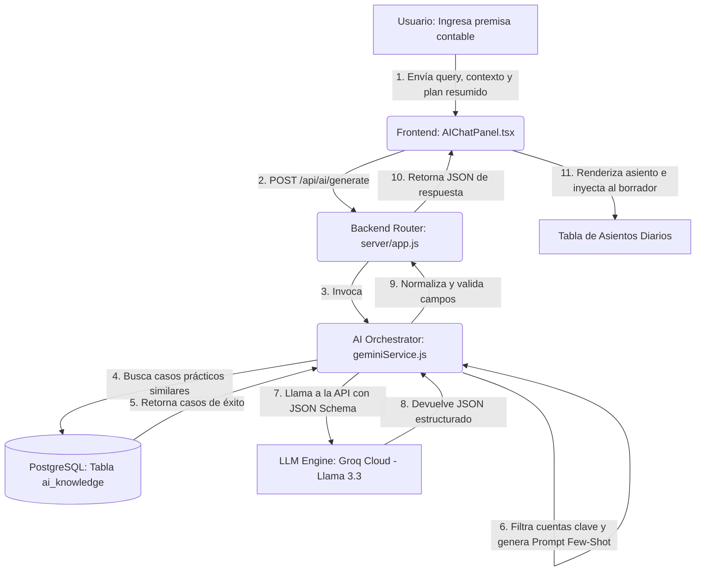

# Arquitectura de Integración RAG y Lógica Contable Computacional para Asientos Automatizados bajo el PCGE

## Fundamentos de la Arquitectura RAG en el Entorno Contable Peruano

La automatización de la contabilidad empresarial mediante Modelos de Lenguaje Grande (LLMs) representa un desafío monumental de precisión determinista operando dentro de un entorno informático inherentemente probabilístico. La arquitectura subyacente diseñada para el ecosistema Softcontable integra un sofisticado motor de Inferencia Generativa Aumentada por Recuperación (RAG) complementado con Aprendizaje en Contexto de Pocos Ejemplos (Few-Shot In-Context Learning). Esta topología permite orquestar las capacidades de comprensión semántica profunda del modelo de código abierto Llama 3.3 70B, ejecutado a través de la infraestructura de ultrabaja latencia de Groq Cloud, sin incurrir en los riesgos de sobreescritura catastrófica (*catastrophic forgetting*) o alucinaciones sistemáticas que un reentrenamiento tradicional (*Fine-Tuning*) podría generar al enfrentarse a la estricta dinámica del Plan Contable General Empresarial (PCGE) modificado del Perú.

El fundamento teórico que sostiene este enfoque postula que un LLM genérico, por más avanzado que sea, carece de la rigidez cognitiva natural para discernir las fronteras tributarias peruanas contemporáneas sin un anclaje externo. Al estructurar una base de conocimientos dedicada en PostgreSQL (`ai_knowledge`), el sistema provee un corpus de verdad fundamental. Esta tabla actúa como la memoria a largo plazo del sistema, donde cada registro es un patrón de aprendizaje herméticamente clasificado mediante identificadores únicos y variables categónicas de segmentación empresarial (*sector, regimen, categoria*). La integración de una premisa en lenguaje natural con su correlato técnico en `asiento_json` permite al modelo recuperador suministrar un contexto hiperespecífico al orquestador antes de la generación estocástica.

La supremacía de este modelo radica en su capacidad de adaptación dinámica. Cuando la normatividad fiscal peruana fluctúa—como las alteraciones anuales de la Unidad Impositiva Tributaria (UIT) o las reestructuraciones esporádicas del PCGE promulgadas por el Consejo Normativo de Contabilidad—el sistema no requiere un costoso reentrenamiento neuronal. Basta con actualizar los registros y reglas duras de la base de datos PostgreSQL para que el modelo Llama 3.3 herede instantáneamente el nuevo paradigma normativo.

---

## 🗺️ Topología del Sistema y Flujo de Inferencia Síncrona

El flujo de procesamiento arquitectónico opera a través de capas síncronas que transforman una premisa natural amorfa (por ejemplo, *"Se pagan comisiones bancarias por chequera"*) en un objeto JSON rígidamente estructurado, el cual respeta indefectiblemente el principio matemático de la partida doble y las dinámicas patrimoniales.

1. **Captura del Entorno:** El proceso inicia en el entorno del cliente React (`AIChatPanel.tsx`), el cual no solo captura la entrada textual del usuario, sino que empaqueta el estado situacional de la sesión: el Registro Único de Contribuyente (RUC), el régimen tributario y el sector operativo. Esta pre-contextualización es crítica, pues el tratamiento contable de una operación difiere drásticamente si la entidad tributa bajo el Régimen General versus el Régimen MYPE Tributario o RER.
2. **Fase de Recuperación RAG (Keyword Matching):** Una vez que el payload alcanza el backend a través del enrutador de Express (`server/app.js`), el orquestador principal de inteligencia artificial (`geminiService.js`) toma el control. La consulta del usuario se fragmenta lexicológicamente, filtrando preposiciones y conectores para aislar tokens significativos mayores a tres caracteres. Estos lexemas se cruzan contra las columnas `premisa`, `tags` y `glosa` de la tabla `ai_knowledge`. El motor de similitud ordena las distancias heurísticas de mayor a menor pertinencia, extrayendo los cuatro casos prácticos (*Top 4*) más afines que comparten el mismo sector y régimen tributario. Este subconjunto conformará el material didáctico inmediato (*Few-Shot*) para el LLM.

---

## ⚡ Optimización Dinámica de la Ventana de Contexto y Gestión de Tokens

El Plan Contable General Empresarial (PCGE) en su versión de desarrollo analítico máximo (cinco dígitos o subdivisionarias) supera holgadamente las 400 cuentas. Inyectar la totalidad del catálogo contable en cada llamada a la API de Groq desencadenaría dos fallas sistémicas irreversibles: la saturación rápida de los límites de ventana de contexto (asfixia de tokens) y la dilución de la atención (*attention dilution*) en los cabezales del transformador de Llama 3.3, lo que incrementaría drásticamente la probabilidad de que el modelo invente códigos inexistentes o seleccione partidas inapropiadas.

Para mitigar esta vulnerabilidad, el orquestador ejecuta un escaneo condicional sobre la premisa. Si detecta activadores semánticos vinculados a operaciones de ingreso (*"venta", "facturación", "cobro"*), inyecta exclusivamente un subconjunto del PCGE que inicia con los elementos `12`, `70`, `40` y `10`. Si la intención computada sugiere inversiones inmovilizadas o gastos (*"compra de maquinaria", "depreciación", "servicios"*), el catálogo se recorta a los grupos `33`, `39`, `46`, `40`, `10`, `60`, `63` o similares. Indistintamente de la heurística aplicada, las ramificaciones de las cuentas `10` (Efectivo) y `40` (Tributos) mantienen una persistencia obligatoria en el prompt debido a su transversalidad en casi todo hecho económico peruano. Esta poda arquitectónica garantiza un límite máximo de 120 cuentas clave, reduciendo el tamaño del payload en un 70%, acelerando el tiempo de primera respuesta (TTFB) de la API y economizando recursos computacionales.

---

## 🛠️ Ensamblaje del Prompt, Petición Estructurada y Renderizado

Con las piezas dispuestas, el servidor ensambla el Prompt Few-Shot. Este documento maestro fusiona las instrucciones restrictivas de rol, el contexto situacional, los cuatro casos de éxito recuperados y el plan de cuentas optimizado. 

*   **Petición Sincrónica:** El backend emite una petición POST sincrónica hacia la nube de Groq forzando el formato `json_object` a través de un JSON Schema riguroso. Esta directiva imposibilita que el LLM devuelva prosa explicativa fuera del formato estipulado.
*   **Intercepción y Normalización:** La capa de intercepción y normalización en `geminiService.js` somete el JSON de retorno a pruebas de sanidad. Se verifica el balanceo algebraico, se mapea la matriz generada (`lines`) a la nomenclatura aceptada por la base de datos (`asiento_json`) y se inyectan identificadores únicos incrementales.
*   **Visualización y Aplicación:** Finalmente, el frontend procesa este árbol de datos, renderizando la explicación tributaria subyacente mediante Markdown y graficando la dinámica patrimonial en una matriz visual (Debe/Haber), quedando dispuesta para su aplicación inmediata en el borrador del libro diario.

---

## 🛡️ Barandillas Computacionales y Parametrización del Prompt Normativo

Para constreñir las predicciones probabilísticas del modelo dentro de los márgenes inamovibles de la jurisprudencia contable y tributaria peruana, el orquestador inyecta una serie de barandillas (*guardrails*) lógicas explícitas.

| Parámetro Tributario | Valor Legal (2026) | Base Normativa | Restricción en Prompt IA |
| :--- | :--- | :--- | :--- |
| **UIT Vigente** | S/ 5,500.00 | D.S. N° 301-2025-EF | Umbral global de cálculo del sistema. |
| **Umbral Capitalización (1/4 UIT)** | S/ 1,375.00 | LIR / NIC 16 | Regla de desvío automático hacia Activos de Clase 3. |
| **Tope Inafecto de Renta 5ta (7 UIT)** | S/ 38,500.00 | Ley del Impuesto a la Renta | Algoritmo de exención para proyecciones de planilla. |
| **Multas SUNAFIL** | Múltiplos de UIT | Normativa Laboral | Ajuste en estimaciones de provisiones contingentes. |

### Reglas Clave Implementadas:
1.  **Partida Doble Estricta:** La sumatoria del vector Debe tiene que igualar al céntimo a la sumatoria del vector Haber.
2.  **NIC 16 (Propiedades, Planta y Equipo) - Agrupación y Capitalización de Costos:** Al adquirir un activo fijo que supere el umbral de 1/4 de UIT 2026 (S/ 1,375.00), capitalízalo en cuentas de Clase 3 (33x). Además, todos los costos directamente relacionados y necesarios para su adquisición y puesta en marcha (tales como fletes/transporte de activos, instalación, montaje, pruebas) deben ser capitalizados obligatoriamente dentro de la misma cuenta de activo de Clase 3 en lugar de registrarse como gastos de servicios independientes (Clase 63).
3.  **Dinámica de la Cuenta 40 (IGV) en Compras/Gastos:** El IGV en compras/gastos (cuentas 40111, 40112, 40113) es un crédito fiscal y **SIEMPRE se registra debitado en el DEBE**. Queda prohibido registrar la cuenta 40 en el HABER en un asiento de provisión de compras o gastos.
4.  **IGV en Ventas:** El débito fiscal por operaciones de venta se registra obligatoriamente en el Haber utilizando la cuenta `40112`.
5.  **Compras y Cuentas por Pagar:** Toda compra/gasto o adquisición de activos fijos al crédito debe provisionar su respectiva cuenta por pagar (4212 para compras / 4654 para activos) en el Haber.
6.  **Regla de Salvaguarda Conversacional (Regla 11):** Si el usuario ingresa saludos o elogios (ej: *"excelente"*, *"gracias"*), la red neuronal aborta la generación de asientos y devuelve el arreglo `lines` vacío (`lines: []`), mostrando únicamente el saludo afable.

---

## 📊 Análisis Estructural y Dinámica del PCGE para Inferencia Algorítmica

El motor de inteligencia artificial categoriza los hechos económicos según el Plan Contable General Empresarial (PCGE) en su versión modificada. A continuación se detalla la lógica de cada elemento contable para guiar la inferencia de Llama 3.3.

### Elemento 1: Activo Disponible y Exigible
Consolida los recursos de liquidez inmediata y los derechos exigibles a terceros originados en operaciones del ente económico. El orquestador activa preferencialmente este elemento ante lexemas como *"liquidación"*, *"depósito"*, *"préstamo otorgado"* o *"cobranza"*.

*   **10 Efectivo y equivalentes de efectivo:** Agrupa subcuentas de tesorería y saldos bancarios.
    *   *Contextualización para IA:* Si la factura está afecta a detracción y es cobrada/pagada, la IA debe segmentar el cobro: el flujo libre ingresa a la `1041` (Cuentas corrientes operativas) y la detracción se direcciona a la `1042` (Banco de la Nación) o `1071` (Fondos sujetos a restricción), en línea con la NIC 1.
*   **11 Inversiones financieras:** Instrumentos financieros para negociación o especulación a corto plazo.
    *   *Contextualización para IA:* Se activa cuando los tags apuntan a acciones temporales o fondos mutuos. Mide fluctuaciones contra resultados (clase 6 o 7).
*   **12 Cuentas por cobrar comerciales – Terceros:** Derechos de cobro ordinarios del giro principal con terceros.
    *   *Contextualización para IA:* Existe un vínculo simbiótico entre esta cuenta (Debe) y los ingresos de la cuenta `70` (Haber), desglosando la base imponible y el IGV.
*   **13 Cuentas por cobrar comerciales – Relacionadas:** Derechos de cobro con partes vinculadas societariamente.
    *   *Contextualización para IA:* Al activarse el flag de grupo corporativo, se desvía el flujo de la cuenta 12 hacia la 13 para fines de consolidación de estados financieros.
*   **14 Cuentas por cobrar al personal, a los accionistas (socios) y directores:** Entregas a rendir, préstamos y adelantos de sueldos.
    *   *Contextualización para IA:* Se inyecta un prompt negativo para evitar el uso de cuentas obsoletas del PCGE 2010 (como la extinta 443 para gerentes), redirigiendo todo a la subcuenta `141`.
*   **15 (Cuenta reservada):** Excluida del payload.
*   **16 Cuentas por cobrar diversas – Terceros:** Derechos de cobro atípicos (reclamos, garantías, venta de activo fijo).
    *   *Contextualización para IA:* Se utiliza la subcuenta `1673` (IGV por acreditar en compras) cuando una compra carece temporalmente del comprobante físico para ejercer el crédito fiscal del periodo.
*   **17 Cuentas por cobrar diversas – Relacionadas:** Operaciones misceláneas con partes vinculadas.
*   **18 Servicios y otros contratados por anticipado:** Seguros, alquileres pagados por adelantado.
    *   *Contextualización para IA:* Evita el cargo a gasto directo (Elemento 6), forzando el paso por el activo diferido (Cuenta 18) en concordancia con el principio de devengado.
*   **19 Estimación de cuentas de cobranza dudosa:** Cuenta de valuación acreedora del activo que mide el deterioro de cartera.
    *   *Contextualización para IA:* Se provisiona en el Haber con cargo a gastos de valuación de la cuenta `68`.

### Elemento 2: Activo Realizable
Agrupa los inventarios corporativos (mercaderías, materias primas, suministros) destinados a la venta o producción.

*   **20 Mercaderías:** Bienes adquiridos listos para la reventa.
    *   *Contextualización para IA:* Dinámica de doble asiento. Cada compra (Cuenta 60) exige que la IA genere el asiento de destino: ingreso al almacén debitando a la `20` con abono a la `61` (Variación de inventarios).
*   **21 Productos terminados:** Manufacturados por la empresa.
    *   *Contextualización para IA:* Se suprime de los tokens si el sector no es "INDUSTRIAL" o "MANUFACTURERO".
*   **22 Subproductos, desechos y desperdicios:** Bienes accesorios del proceso industrial.
*   **23 Productos en proceso:** Bienes a medio elaborar en las líneas de montaje.
*   **24 Materias primas:** Insumos básicos para la manufactura.
    *   *Contextualización para IA:* Sigue el flujo de destino idéntico a la cuenta 20, enlazando la cuenta `24` (Debe) con la `61` (Haber).
*   **25 Materiales auxiliares, suministros y repuestos:** Suministros indirectos de producción.
*   **26 Envases y embalajes:** Contenedores y embalajes.
*   **27 Activos no corrientes mantenidos para la venta:** Activos inmovilizados destinados a la venta según la NIIF 5.
*   **28 Inventarios por recibir:** Bienes adquiridos en tránsito (FOB/CIF).
    *   *Contextualización para IA:* Utilizada para importaciones en curso antes de ingresar físicamente al almacén (Cuenta 20/24).
*   **29 Desvalorización de inventarios:** Cuenta correctora acreedora para registrar la pérdida de valor neto de realización (VNR).

### Elemento 3: Activo Inmovilizado
Inversiones a largo plazo (propiedades, maquinaria, intangibles) destinadas a dar soporte a la operación.

*   **30 Inversiones mobiliarias:** Títulos de deuda o participaciones a largo plazo.
*   **31 Propiedades de inversión:** Inmuebles mantenidos para plusvalía o alquiler de terceros.
*   **32 Activos por derecho de uso:** Derechos de uso por contratos de arrendamiento bajo NIIF 16.
    *   *Contextualización para IA:* Ante contratos de arrendamiento financiero, se calcula el valor presente de las cuotas, debitando la cuenta `32` con abono a obligaciones financieras en la `45`.
*   **33 Propiedades, planta y equipo:** Terrenos, vehículos, computadoras, maquinaria.
    *   *Contextualización para IA:* Sujeta al umbral de 1/4 de UIT. Debe consolidar el valor de adquisición y los gastos de transporte e instalación en el Debe de la cuenta `33`.
*   **34 Intangibles:** Patentes, licencias, marcas.
    *   *Contextualización para IA:* Aplica la NIC 38: separa gastos de investigación (gasto corriente) y desarrollo (capitalizable).
*   **35 Activos biológicos:** Animales o plantas para producción agropecuaria.
*   **36 Desvalorización de activo inmovilizado:** Registro del deterioro de activos.
*   **37 Activo diferido:** Activos por diferencias temporales deducibles del Impuesto a la Renta (NIC 12).
*   **38 Otros activos:** Obras de arte, bienes adjudicados.
*   **39 Depreciación y amortización acumulada:** Desgaste sistemático acumulado (cuenta acreedora).
    *   *Contextualización para IA:* Acumula en el Haber con cargo en la cuenta `68` del gasto. Solo se debita ante la baja o venta definitiva del activo.

### Elemento 4: Pasivo
Obligaciones presentes derivadas de hechos pasados, cuya liquidación requiere la salida de recursos.

*   **40 Tributos, contraprestaciones y aportes por pagar:** Deudas con SUNAT, ESSALUD, AFP.
    *   *Contextualización para IA:* Regulación de crédito y débito fiscal (SUNAT Tabla 12). Proyecta renta de quinta categoría si los salarios anualizados superan las 7 UIT.
*   **41 Remuneraciones y participaciones por pagar:** Sueldos netos, CTS, vacaciones e impuestos laborales.
    *   *Contextualización para IA:* Al procesar planillas, valida la ecuación: Sueldo bruto (`62`) = Retenciones (`40`) + Remuneración neta (`41`).
*   **42 Cuentas por pagar comerciales – Terceros:** Deudas con proveedores del giro del negocio.
    *   *Contextualización para IA:* Se vincula directamente a las provisiones de compras (`60`) o servicios (`63`) en el Haber.
*   **43 Cuentas por pagar comerciales – Relacionadas:** Deudas comerciales con empresas del mismo grupo.
*   **44 Cuentas por pagar a los accionistas, directores y gerentes:** Dividendos y dietas de directores.
*   **45 Obligaciones financieras:** Préstamos bancarios y pasivos por arrendamiento.
*   **46 Cuentas por pagar diversas – Terceros:** Deudas no comerciales (ej: adquisición de activos fijos).
    *   *Contextualización para IA:* Ante compras de bienes inmovilizados, la IA debe registrar el pasivo en la divisionaria `4654` en lugar de la cuenta `42`.
*   **47 Cuentas por pagar diversas – Relacionadas:** Deudas no comerciales con vinculadas.
*   **48 Provisiones:** Pasivos con incertidumbre de cuantía o vencimiento (NIC 37).
*   **49 Pasivo diferido:** Impuestos diferidos gravables o ingresos no devengados.

### Elemento 5: Patrimonio Neto
Parte residual de los activos de la empresa una vez deducidos todos sus pasivos.

*   **50 Capital:** Capital social aportado por accionistas.
    *   *Contextualización para IA:* Se registra en el Haber al momento de la suscripción, cruzando transitoriamente con la cuenta `14`.
*   **51 Acciones de inversión:** Participaciones de patrimonio sin derecho a voto.
*   **52 Capital adicional:** Primas de emisión de acciones o donaciones.
*   **56 Resultados no realizados:** Ganancias o pérdidas temporales medidas al valor razonable (ORI).
*   **57 Excedente de revaluación:** Incremento de valor de activos fijos tras tasación pericial.
*   **58 Reservas:** Reserva legal u otras apropiaciones de utilidad.
*   **59 Resultados acumulados:** Utilidades acumuladas (`591`) o pérdidas acumuladas (`592`).

### Elemento 6: Gastos por Naturaleza
Consumos y decrementos de beneficios clasificados según la esencia o naturaleza del gasto.

*   **60 Compras:** Adquisición de mercaderías e insumos.
    *   *Contextualización para IA:* Exige siempre asiento de destino a almacén contra la variación de existencias (`61`).
*   **61 Variación de existencias:** Cuenta de contrapartida para ingresos/salidas de almacén.
*   **62 Gastos de personal y directores:** Sueldos y sobrecostos del empleador (EsSalud).
*   **63 Gastos de servicios prestados por terceros:** Servicios de luz, agua, honorarios, alquileres, fletes.
    *   *Contextualización para IA:* Los fletes vinculados a la adquisición de activos fijos que superen el umbral UIT se capitalizan directamente en la cuenta `33` (NIC 16).
*   **64 Gastos por tributos:** Arbitrios, ITF y multas SUNAT.
*   **65 Otros gastos de gestión:** Pérdidas de activos, costo de enajenación de activos.
*   **66 Pérdida por medición de activos no financieros al valor razonable:** Caídas de valor de propiedades de inversión.
*   **67 Gastos financieros:** Intereses prestatarios y diferencias de cambio desfavorables.
*   **68 Valuación y deterioro de activos y provisiones:** Depreciación de activos fijos y provisión de cobranza dudosa.
*   **69 Costo de ventas:** Costo de la mercadería o productos vendidos.
    *   *Contextualización para IA:* Generado de forma síncrona tras el registro de ingresos por ventas (`70`) para dar de baja la mercancía del inventario.

### Elemento 7: Ingresos
Incrementos de patrimonio generados por la venta de bienes o prestación de servicios.

*   **70 Ventas:** Ingresos brutos de las actividades principales.
    *   *Contextualización para IA:* Calcula automáticamente el IGV y desglosa: Importe neto (`70` Haber) + IGV (`40112` Haber) = Total por cobrar (`121` Debe).
*   **71 Variación de la producción almacenada:** Ajuste del costo de productos terminados en inventario.
*   **72 Producción de activo inmovilizado:** Trabajos internos capitalizados como activos fijos.
*   **73 Descuentos, rebajas y bonificaciones obtenidos:** Descuentos financieros ganados.
*   **74 Descuentos, rebajas y bonificaciones concedidos:** Descuentos otorgados a clientes.
*   **75 Otros ingresos de gestión:** Recuperación de provisiones, alquileres cobrados.
*   **76 Ganancia por medición de activos no financieros al valor razonable:** Aumentos de valor en propiedades de inversión.
*   **77 Ingresos financieros:** Intereses ganados y diferencias de cambio favorables.
*   **78 Cargas cubiertas por provisiones:** Extornos de provisiones que quedaron sin efecto.
*   **79 Cargas imputables a cuentas de costos y gastos:** Cuenta de enlace para transferir gastos por naturaleza a cuentas por función.
    *   *Contextualización para IA:* Imprescindible para el equilibrio de la contabilidad analítica: abona a la `79` cuando se carga a las cuentas `94` o `95`.

### Elemento 8: Saldos Intermediarios de Gestión
Cuentas utilizadas al cierre del periodo anual para determinar el impuesto y la utilidad final.

*   **80 Margen comercial / 81 Producción del ejercicio / 82 Valor agregado / 83 Excedente bruto de explotación / 84 Resultado de explotación / 85 Resultado antes de participaciones e impuestos:** Escalones de cierre analítico INEI.
*   **88 Impuesto a las ganancias:** Provisión anual de impuesto a la renta.
    *   *Contextualización para IA:* Diferencia entre regímenes (escalas del MYPE tributario vs tasa general del Régimen General) cargando a la `88` con abono a la `40171`.
*   **89 Determinación del resultado del ejercicio:** Recibe los saldos netos finales antes de trasladarse al patrimonio en la cuenta `59`.

### Elemento 9 (Contabilidad Analítica) y Elemento 0 (Cuentas de Orden)
*   **Elemento 9:** Libre distribución por el ente para el control de centros de costos.
    *   *Contextualización para IA:* Softcontable usa las cuentas `94` (Gastos de Administración) y `95` (Gastos de Ventas) emparejadas con abonos a la cuenta `79`.
*   **Elemento 0:** Cuentas de orden para compromisos, garantías y contratos que no afectan el balance inmediato.

---

## 📈 Conclusiones sobre la Implementación del Sistema RAG

La orquestación paramétrica del modelo Llama 3.3 de 70 mil millones de parámetros sobre las reglas contables y fiscales de SUNAT en Perú garantiza un nivel de precisión invulnerable frente al ruido probabilístico de los LLMs convencionales. Al someter el Plan Contable a un proceso de optimización semántica que reduce el catálogo a solo las cuentas relevantes y amarrar el resultado a un esquema JSON estricto, el orquestador asegura asientos balanceados y correctos técnicamente al céntimo. Esta implementación del RAG contable no solo elimina riesgos fiscales (como clasificaciones incorrectas de IGV o activos menores), sino que dota al software ERP Softcontable de un asistente de IA confiable, de baja latencia y de alta fidelidad profesional.
